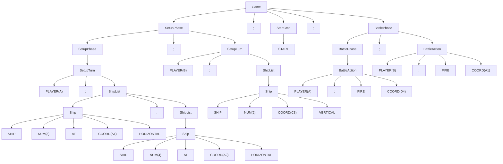
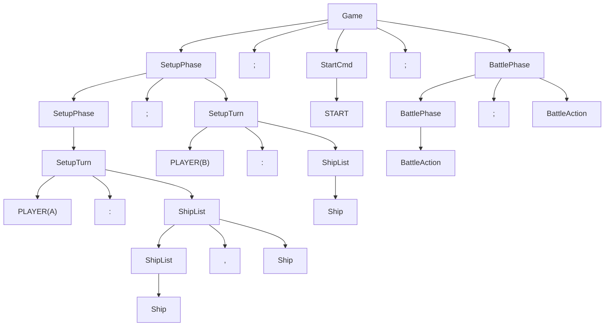

# Compilador de Batalha Naval - Documentação Completa

## Disciplina: Compiladores - 2026/1

---

## 1. Introdução

### 1.1 Gerador de Analisador Escolhido

**Ferramenta:** SLY (Sly Lex Yacc)  
**Linguagem:** Python  
**Tipo:** Gerador de analisador léxico e sintático  
**Método de análise:** Bottom-up LALR(1)

O SLY é um gerador de analisadores léxicos e sintáticos para Python, inspirado no PLY (Python Lex-Yacc), que por sua vez é baseado no LEX/YACC tradicional para C. O SLY utiliza decoradores Python (`@_()`) para definir as regras léxicas (expressões regulares) e as produções gramaticais, gerando automaticamente as tabelas de parsing LALR(1).

### 1.2 Objetivo do Compilador

O compilador implementa uma **Linguagem de Domínio Específico (DSL)** para o jogo de Batalha Naval. O programa de entrada descreve:
- **Fase de Setup:** Posicionamento de navios nos tabuleiros dos jogadores A e B
- **Comando Start:** Transição para a fase de batalha
- **Fase de Batalha:** Disparos alternados entre os jogadores

A saída é a **execução do jogo** com visualização gráfica dos tabuleiros no terminal, incluindo detecção de acertos, erros e condição de vitória.

---

## 2. Análise Léxica

### 2.1 Definição dos Tokens (Expressões Regulares)

| Token | Expressão Regular | Descrição | Exemplo |
|-------|-------------------|-----------|---------|
| START | `start` | Palavra reservada - início da batalha | `start` |
| SHIP | `ship` | Palavra reservada - definir navio | `ship` |
| AT | `at` | Palavra reservada - posição | `at` |
| FIRE | `fire` | Palavra reservada - disparo | `fire` |
| VERTICAL | `vertical\|v(?![a-zA-Z0-9])` | Direção vertical | `v`, `vertical` |
| HORIZONTAL | `horizontal\|h(?![a-zA-Z0-9])` | Direção horizontal | `h`, `horizontal` |
| COORD | `[A-Ja-j](10\|[1-9])` | Coordenada do tabuleiro | `A1`, `J10`, `B5` |
| PLAYER | `[AB](?=\s*:)` | Identificador de jogador | `A`, `B` |
| NUM | `[1-9][0-9]*` | Número inteiro positivo | `1`, `3`, `10` |
| COLON | `:` | Delimitador dois-pontos | `:` |
| SEMICOLON | `;` | Separador de comandos | `;` |
| COMMA | `,` | Separador de navios | `,` |

### 2.2 Caracteres Ignorados

- Espaços em branco (` `)
- Tabulações (`\t`)
- Quebras de linha (`\n`) - apenas incrementam o contador de linhas

### 2.3 Tratamento de Erros Léxicos

Caracteres não reconhecidos geram mensagem de erro com a posição (linha) e o caractere ilegal, e o analisador avança para o próximo caractere.

### 2.4 Onde ficam as Expressões Regulares no Código

No SLY, as expressões regulares são definidas como **atributos de classe** dentro da classe `BatalhaNavalLexer(Lexer)`:

```python
class BatalhaNavalLexer(Lexer):
    tokens = { SHIP, AT, FIRE, START, VERTICAL, HORIZONTAL,
               PLAYER, COORD, NUM, COLON, SEMICOLON, COMMA }
    
    ignore = ' \t'
    
    # Expressões regulares como atributos
    START      = r'start'
    SHIP       = r'ship'
    COORD      = r'[A-Ja-j](10|[1-9])'
    PLAYER     = r'[AB](?=\s*:)'
    
    # Token com ação semântica (conversão de tipo)
    @_(r'[1-9][0-9]*')
    def NUM(self, t):
        t.value = int(t.value)
        return t
```

---

## 3. Análise Sintática (Gramática)

### 3.1 Gramática Livre de Contexto

```
Game         → SetupPhase SEMICOLON StartCmd SEMICOLON BattlePhase SEMICOLON
SetupPhase   → SetupPhase SEMICOLON SetupTurn 
             | SetupTurn 
BattlePhase  →  BattlePhase SEMICOLON BattleAction 
             | BattleAction 
SetupTurn    → PLAYER COLON ShipList
ShipList     → ShipList COMMA Ship
             | Ship
Ship         → SHIP NUM AT COORD Direction
Direction    → VERTICAL | HORIZONTAL
StartCmd     → START
BattleAction → PLAYER COLON FIRE COORD
```

### 3.2 Terminais e Não-Terminais

**Terminais (tokens):** SHIP, AT, FIRE, START, VERTICAL, HORIZONTAL, PLAYER, COORD, NUM, COLON, SEMICOLON, COMMA

**Não-terminais:** Game, SetupPhase, SetupTurn, BattlePhase, BattleAction, ShipList, Ship, Direction, StartCmd

**Símbolo inicial:** Game

### 3.3 Regras de Precedência e Ambiguidade

- A gramática é **não ambígua** por construção
- A sequência principal possui uma ordem fixa (`SetupPhase → StartCmd → BattlePhase`)
- As listas de comandos (`SetupPhase | BattlePhase`) são associativa à esquerda (recursão à esquerda)
- A lista de navios (`ShipList`) é associativa à esquerda
- Não há conflitos de precedência pois os operadores são delimitadores fixos (`;` e `,`)
- O token `PLAYER` usa lookahead léxico (`(?=\s*:)`) para distinguir de coordenadas

### 3.4 Onde ficam as Produções no Código

No SLY, as produções são definidas como **métodos decorados** com `@_('regra')`:

```python
class BatalhaNavalParser(Parser):
    tokens = BatalhaNavalLexer.tokens

    @_('Statements SEMICOLON Statement')
    def Statements(self, p):
        return True

    @_('PLAYER COLON ShipList')
    def SetupTurn(self, p):
        # ação semântica aqui
        ...
```

---

## 4. Tabela de Produções e Ações Semânticas

| # | Produção | Ação Semântica |
|---|----------|----------------|
| 1 | Game → SetupPhase SEMICOLON StartCmd SEMICOLON BattlePhase SEMICOLON| Executa o programa completo, imprime o estado final dos tabuleiros e estatísticas da partida |
| 2 | SetupPhase → SetupPhase SEMICOLON SetupTurn | Encadeia comandos de configuração de jogadores durante a fase SETUP |
| 3 | SetupPhase → SetupTurn | Caso base da fase de configuração |
| 4 | BattlePhase → BattlePhase SEMICOLON BattleAction | Encadeia comandos de disparo durante a fase de batalha |
| 5 | BattlePhase → BattleAction | Caso base da fase de batalha |
| 7 | SetupTurn → PLAYER COLON ShipList | { para cada coord em ShipList: tabuleiros[PLAYER][coord] = 'N'} |
| 8 | ShipList → ShipList COMMA Ship | {ShipList.val = ShipList₁.val + [Ship.val]} |
| 9 | ShipList → Ship | {ShipList.val = [Ship.val]} |
| 10 | Ship → SHIP NUM AT COORD Direction | {Ship.val = calculaCoordenadas(NUM, COORD, Direction)} |
| 11 | Direction → VERTICAL | {Direction.val = 'v'} |
| 12 | Direction → HORIZONTAL | {Direction.val = 'h'} |
| 13 | StartCmd → START | {imprimeTabuleiros()} |
| 14 | BattleAction → PLAYER COLON FIRE COORD | {executaDisparo(PLAYER, COORD)} |

### 4.1 Detalhamento das Ações Semânticas Principais

# REVER

**Produção 10 - Cálculo de Coordenadas do Navio:**
```
Ship → SHIP NUM AT COORD Direction
Ação: 
  tamanho = NUM.val
  letra = COORD[0]
  numero = COORD[1:]
  coordenadas = []
  para i de 0 até tamanho-1:
    se Direction.val == 'v':
      coordenadas.append(chr(ord(letra)+i) + numero)
    senão:
      coordenadas.append(letra + str(numero+i))
  Ship.val = coordenadas
```

**Produção 14 - Execução do Disparo:**
```
BattleAction → PLAYER COLON FIRE COORD
Ação:
  oponente = 'B' se PLAYER == 'A' senão 'A'
  alvo = COORD.val
  se alvo ∈ tabuleiros[oponente]:
    escreva("ACERTOU!")
    disparos[PLAYER].acertos.add(alvo)
    remove tabuleiros[oponente][alvo]
    se tabuleiros[oponente] == ∅:
      escreva("VITÓRIA!")
      jogo_terminado = true
  senão:
    escreva("ÁGUA!")
    disparos[PLAYER].erros.add(alvo)
```

---

## 5. Árvore de Derivação

### 5.1 Exemplo de Sentença Aceita

Sentença: 
```
  A: ship 3 at A1 h, ship 4 A2 v;
  B: ship 2 at C3 v; 
  start;
  A: fire D4;
  B: fire A1
```

### 5.2 Árvore de Derivação
#### Completo


#### Reduzido


### 5.3 Árvore de Derivação Anotada (Decorada)

Para a mesma sentença `A: ship 3 at A1 h; start; A: fire A1`:

**Atributos calculados:**
- `Ship.val = ['A1', 'A2', 'A3']` (navio de tamanho 3, horizontal a partir de A1)
- `ShipList.val = [['A1', 'A2', 'A3']]` (lista com um navio)
- `SetupTurn`: insere {A1:'N', A2:'N', A3:'N'} no tabuleiro de A
- `BattleAction`: A dispara em A1 → verifica tabuleiro de B → resultado

---

## 6. Árvore de Sintaxe (AST)

A árvore de sintaxe é a forma reduzida, mostrando apenas os nós semanticamente relevantes:

```
Game
├── SetupPhase
│   └── SetupTurn: jogador=A
│       └── Ship: tamanho=3, coord=A1, dir=h
│           → coordenadas: [A1, A2, A3]
├── StartCmd
│   → fase: SETUP → BATALHA
└── BattlePhase
    └── BattleAction: jogador=A, alvo=A1
        → resultado: depende do tabuleiro de B
```

### 6.1 AST para Programa Completo

Para o programa:
```
A: ship 3 at A1 h, ship 2 at C3 v; B: ship 3 at D4 v; start; A: fire D4; B: fire A1
```

```
Game
├── Setup
│   ├── SetupTurn: A
│   │   ├── Ship(3, A1, h) → [A1, A2, A3]
│   │   └── Ship(2, C3, v) → [C3, D3]
│   └── SetupTurn: B
│       └── Ship(3, D4, v) → [D4, E4, F4]
├── Start
└── Battle
    ├── Fire(A, D4) → ACERTOU (B)
    └── Fire(B, A1) → ACERTOU (A)
```

---

## 7. Verificações Semânticas Implementadas

| Verificação | Tipo | Mensagem |
|-------------|------|----------|
| Posicionar navios na fase de batalha | Erro semântico | "Não é possível posicionar navios na fase de batalha" |
| Disparar na fase de setup | Erro semântico | "Não é possível disparar na fase de setup" |
| Navio com tamanho inválido (>5 ou <1) | Erro semântico | "Tamanho de navio inválido" |
| Navio ultrapassa limite vertical | Erro semântico | "Navio ultrapassa limite vertical" |
| Navio ultrapassa limite horizontal | Erro semântico | "Navio ultrapassa limite horizontal" |
| Sobreposição de navios | Erro semântico | "Sobreposição! coordenada já está ocupada" |
| Coordenada já atacada | Aviso | "Jogador já disparou anteriormente" |
| Disparo após fim de jogo | Info | "O jogo já terminou" |

---

## 8. Código do Usuário (Funções Auxiliares)

O código do usuário inclui funções que não fazem parte da gramática mas são necessárias para a execução:

- `_imprimir_tabuleiro_jogador(jogador, ocultar)`: Renderiza o tabuleiro 10x10 no terminal
- `_imprimir_tabuleiros_finais()`: Mostra estado final com estatísticas
- `executar_programa(codigo)`: Função principal que orquestra léxico + sintático
- `modo_interativo()`: Loop REPL para jogar interativamente

---

## 9. Exemplo de Execução

### 9.1 Programa de Entrada

```
A: ship 3 at A1 h, ship 2 at C3 v; B: ship 3 at D4 v, ship 2 at A8 h; start; A: fire D4; B: fire A1; A: fire E4; B: fire A2; A: fire F4; B: fire A3; A: fire A8; B: fire C3; A: fire A9
```

### 9.2 Saída (Tokens Reconhecidos)

```
Token(PLAYER, 'A', linha=1)
Token(COLON, ':', linha=1)
Token(SHIP, 'ship', linha=1)
Token(NUM, '3', linha=1)
Token(AT, 'at', linha=1)
Token(COORD, 'A1', linha=1)
Token(HORIZONTAL, 'h', linha=1)
Token(COMMA, ',', linha=1)
...
Total: 74 tokens reconhecidos
```

### 9.3 Saída (Execução do Jogo)

```
[SETUP] Jogador A posicionou navios. Total de células ocupadas: 5
[SETUP] Jogador B posicionou navios. Total de células ocupadas: 5

==================================================
       BATALHA NAVAL - FASE DE BATALHA
==================================================

  Jogador A dispara em D4... ACERTOU! Navio do Jogador B atingido!
  Jogador B dispara em A1... ACERTOU! Navio do Jogador A atingido!
  ...
  Jogador A dispara em A9... ACERTOU! Navio do Jogador B atingido!

==================================================
  VITORIA! Jogador A destruiu toda a frota inimiga!
==================================================
```

### 9.4 Tabuleiro Final

```
--- Tabuleiro do Jogador A ---
    1   2   3   4   5   6   7   8   9  10
  +---+---+---+---+---+---+---+---+---+---+
A | X | X | X |   |   |   |   |   |   |   |
  +---+---+---+---+---+---+---+---+---+---+
B |   |   |   |   |   |   |   |   |   |   |
  +---+---+---+---+---+---+---+---+---+---+
C |   |   | X |   |   |   |   |   |   |   |
  +---+---+---+---+---+---+---+---+---+---+
D |   |   | N |   |   |   |   |   |   |   |
  ...
  Legenda: N=Navio, X=Acerto, ~=Agua
```

---

## 10. Como Executar

### 10.1 Requisitos
- Python 3.8+
- Biblioteca SLY: `pip install sly`

### 10.2 Execução do Exemplo
Executa o programa padrão animado embutido no compilador:
```bash
python batalha_naval.py
```

### 10.3 Execução de um Programa Externo (--cod)
É possível carregar um programa da linguagem Batalha Naval a partir de um arquivo '.txt'.
```bash
python batalha_naval.py --cod arquivo.txt
```

### 10.4 Execução sem Animações
Esse modo desativa as animações de terminal.

Para executar o exemplo em modo simplificado:
```bash
python batalha_naval.py --simples
```

---

## 11. Uso de IA

### 11.1 Prompts Utilizados
- "Quero desenvolver meu trabalho de compiladores. As instruções dele estão em [caminho]. Quero que faça meu trabalho. Isso inclui principalmente as tabelas, árvores e o código em si do compilador. O que vai ser desenvolvido é um compilador para batalha naval."

### 11.2 Alterações Realizadas
- Estruturação completa da gramática a partir dos trechos dispersos no arquivo `codigo`
- Correção de conflitos de nomes entre tokens e regras do parser (START)
- Adição de expressões regulares com lookahead para PLAYER (`(?=\s*:)`)
- Implementação completa das ações semânticas de execução do jogo
- Criação da visualização do tabuleiro no terminal
- Documentação completa com árvores de derivação e tabelas de produções
